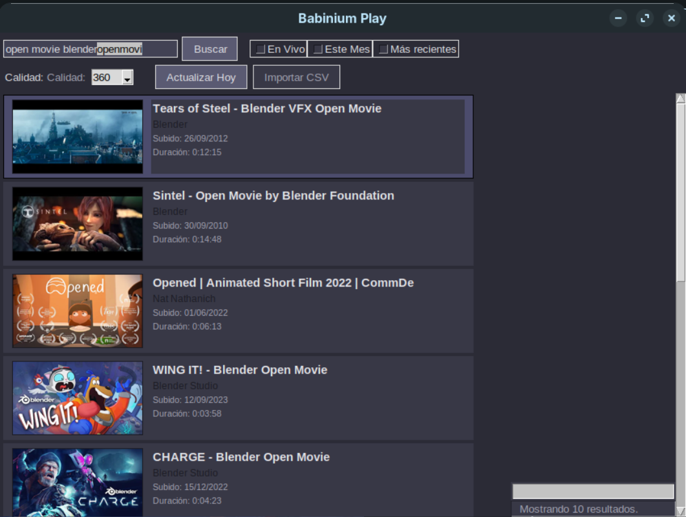
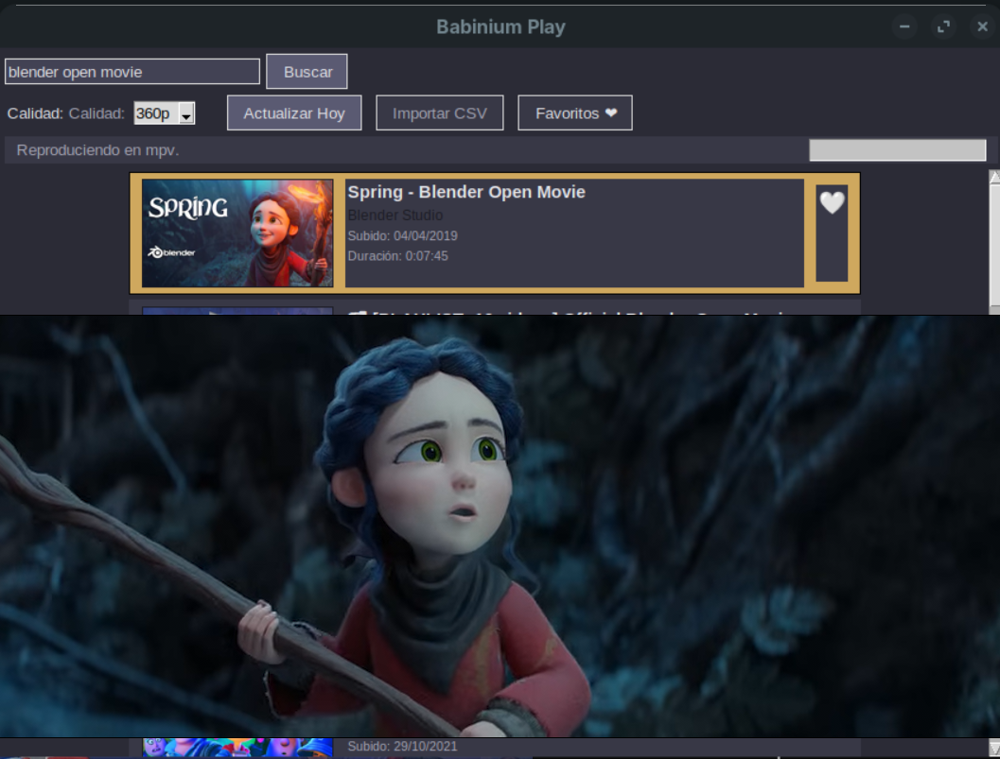

# Babinium-play

<p align="center">
  
  
</p>

**Babinium-play** es un reproductor de música y videos de YouTube ligero y minimalista, diseñado específicamente para distribuciones Linux **derivadas de Debian y Ubuntu** (como AntiX, Zorin OS Lite, Linux Mint, etc.). Está optimizado para funcionar de manera eficiente incluso en equipos con recursos limitados.

## Características principales

- **Búsqueda Integrada**: Busca videos y música directamente desde la aplicación sin necesidad de abrir un navegador.
- **Reproducción Ligera**: Utiliza un motor optimizado para reproducir contenido de YouTube de forma fluida.
- **Interfaz Sencilla**: Una GUI intuitiva construida con Python que prioriza la velocidad y la facilidad de uso.
- **Sin Publicidad Interruptiva**: Una experiencia de visualización y escucha más limpia.

## Requisitos

- Python 3.x
- Dependencias listadas en `requirements.txt`

## Instalación

### Opción 1: Paquete .deb (Recomendado para principiantes)
Esta es la forma más sencilla de instalar Babinium-play en sistemas basados en Debian/Ubuntu (como AntiX o Zorin OS):

1. Ve a la sección de [Releases](https://github.com/babinium/Babinium-play/releases) y descarga el archivo `.deb` más reciente.
2. Abre una terminal en la carpeta donde lo descargaste y ejecuta:
   ```bash
   sudo apt install ./babinium-play.deb
   ```
   *Nota: Esto instalará automáticamente todas las dependencias necesarias.*

### Opción 2: Desde el código fuente (Para otros sistemas o desarrolladores)
Si no utilizas una distribución basada en Debian, o si prefieres ejecutarlo manualmente, puedes usar esta opción:

1. Clona el repositorio:
   ```bash
   git clone https://github.com/babinium/Babinium-play.git
   ```
2. Instala las dependencias:
   ```bash
   pip install -r requirements.txt
   ```
3. Ejecuta la aplicación:
   ```bash
   python main.py
   ```

---
Desarrollado por [babinium](https://github.com/babinium).
